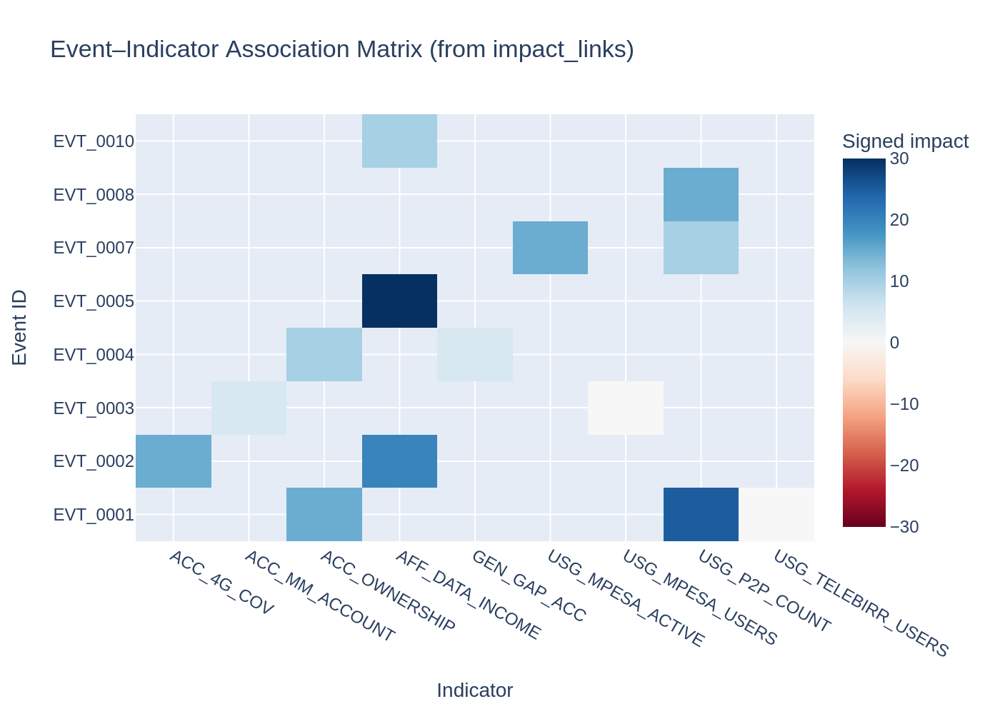
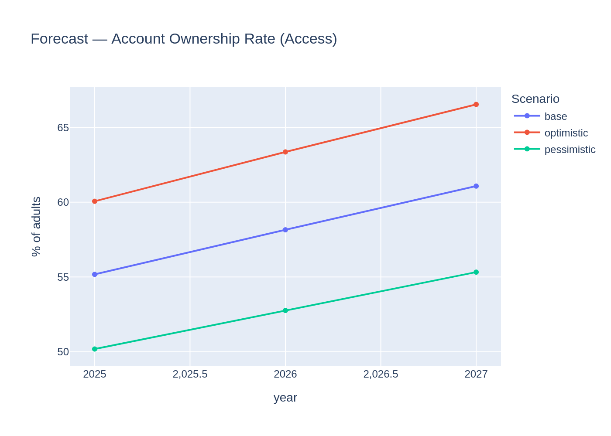
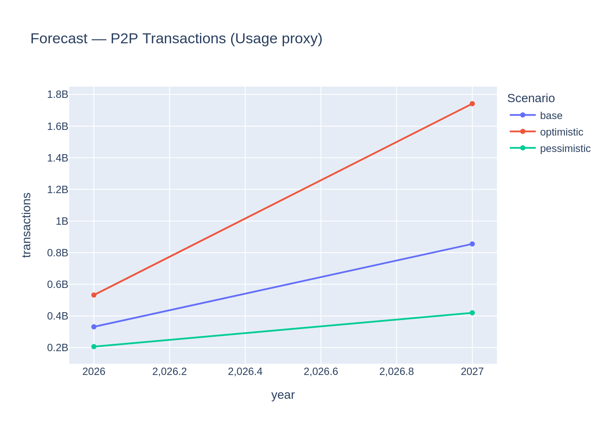

# Forecasting Financial Inclusion in Ethiopia (2025–2027)

**Author:** Selam Analytics (Student submission)  
**Date:** 2026-02-03  

## Executive summary

Ethiopia’s digital finance ecosystem has changed rapidly—Telebirr scaled quickly after 2021 and M‑Pesa entered in 2023—yet Global Findex shows account ownership rising only modestly from 2021 to 2024. This project builds a lightweight forecasting system that:

- Structures Ethiopia’s inclusion data into a unified schema (observations, events, impact links, targets)
- Creates a reproducible data pipeline and documents enrichment
- Builds an event–indicator association matrix to represent how policies/product launches/infrastructure milestones may affect indicators
- Produces scenario-based forecasts for 2025–2027 for:
  - **Access:** Account Ownership Rate (`ACC_OWNERSHIP`)
  - **Usage (proxy):** P2P transaction count (`USG_P2P_COUNT`) as an observable proxy for digital payment activity given sparse survey usage points
- Provides a Streamlit dashboard for stakeholders to explore trends, impacts, and forecasts

Key results (high-level):

- **Access:** A logit-linear trend on 2014–2024 Findex points yields a continued upward trajectory through 2027; uncertainty is expressed via transparent scenario slope adjustments.
- **Usage (proxy):** P2P transactions are forecast using a log-linear trend on available admin observations (sparse) and scenario multipliers.
- **Impact model:** The event–indicator matrix compiles existing `impact_link` assumptions into a single table/heatmap for review and iterative refinement.

> Important: due to data sparsity and mixed measurement sources (survey vs admin), this system emphasizes **transparency** and **scenario ranges** over overfit models.

---

## Data and methodology

### Unified schema
The core dataset uses a unified schema where each row shares the same columns and is interpreted via `record_type`:

- `observation`: measured value (Findex surveys, operator/admin reports, infrastructure metrics)
- `event`: policy/market/infrastructure milestone (pillar intentionally blank to avoid bias)
- `impact_link`: modeled relationship linking an event to an indicator via `parent_id`
- `target`: policy goals (used for benchmarking, not for training)

Primary files:

- `data/raw/ethiopia_fi_unified_data.csv`
- `data/raw/impact_links.csv`
- `data/raw/reference_codes.csv`
- `data/processed/enriched_unified_data.csv`

### Enrichment
To strengthen “enabler” coverage for forecasting, the dataset was enriched with a yearly series:

- **Mobile cellular subscriptions per 100 people** (World Bank WDI `IT.CEL.SETS.P2`), stored as `ACC_MOBILE_PEN`.

All additions are documented in `data_enrichment_log.md`.

### Task 3 — Event impact model
Impact links are converted into an **event–indicator matrix**:

- Rows: events (`event_id`, category, event date)
- Columns: indicators
- Cell value: signed impact = `impact_magnitude × direction(+/-)`

This is a compact way to review assumptions, identify missing links, and later construct intervention covariates.

Figure: Event–indicator association matrix  

### Task 4 — Forecasting (2025–2027)
Because the Access survey signal is low-frequency and Usage survey points are not sufficiently available, forecasting uses two complementary strategies:

1) **Access forecast (Account ownership rate)**
- Target: `ACC_OWNERSHIP` (national, gender=all)
- Model: logit-linear trend over years
- Uncertainty: scenario adjustments to slope (base/optimistic/pessimistic)

Figure: Access forecast  

2) **Usage proxy forecast (P2P transaction count)**
- Target: `USG_P2P_COUNT` (admin series)
- Model: log-linear trend (sparse) + scenario multipliers

Figure: Usage proxy forecast  

Outputs:

- `models/forecast_table.csv`

---

## Key insights from exploratory analysis

(EDA visuals are available in `reports/figures/` and the notebook in `notebooks/task1_task2_eda.ipynb`.)

1) **Access improved strongly up to 2021, then slowed**: Account ownership increased meaningfully from 2014→2017→2021 but only modestly to 2024.

2) **Gender gap exists**: 2021 account ownership differs substantially between men and women, implying that national averages can mask inclusion gaps.

3) **Mobile money account ownership is growing but remains lower than overall access**: Growth in mobile money accounts does not automatically translate into broad-based access.

4) **Digital activity is accelerating in admin series**: P2P transaction metrics and large platform user counts suggest rapid digitization in the ecosystem.

5) **Infrastructure/enablers trend upward**: mobile penetration measures are improving and plausibly support future usage growth.

---

## Dashboard

A Streamlit dashboard is provided to explore:

- Overview metrics and downloadable data
- Interactive trend plots for any indicator
- Event timeline visualization
- Event–indicator matrix heatmap and CSV download
- Forecast plots with scenario selector

Run:

- `streamlit run dashboard/app.py`

Notes on screenshots:

- If your submission requires dashboard screenshots, capture them after running locally (Overview/Trends/Event Impacts/Forecasts pages).

---

## Limitations and future work

- **Data sparsity**: Many indicators have 1–2 points, limiting model complexity and validation.
- **Mixed measurement**: Survey rates and admin counts measure different constructs; careful normalization is needed.
- **Impact links are assumptions**: they must be iteratively refined with evidence and back-testing.
- **Usage target definition**: Findex-defined “digital payment adoption rate” needs more historical survey points; the current system uses P2P count as a measurable proxy.

Future work:

- Enrich usage with additional comparable yearly indicators (e.g., internet use, smartphone adoption, merchant acceptance proxies) and/or additional verified survey points.
- Implement explicit intervention variables from events with lag/decay shapes and validate against historical changes.
- Improve uncertainty quantification via Bayesian regression or robust bootstrapping once more data points exist.

---

## References

- World Bank. Global Findex Database (2014, 2017, 2021, 2024) — methodology and country indicators. https://www.worldbank.org/en/publication/globalfindex
- World Bank. World Development Indicators API — Mobile cellular subscriptions (per 100 people), `IT.CEL.SETS.P2`, Ethiopia. https://api.worldbank.org/

